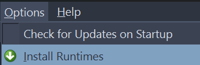
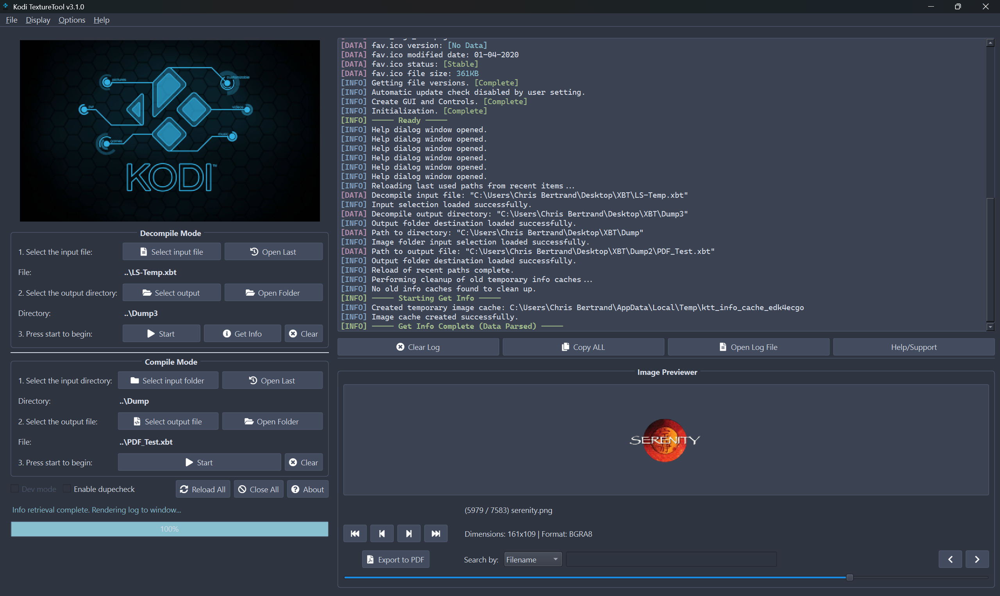
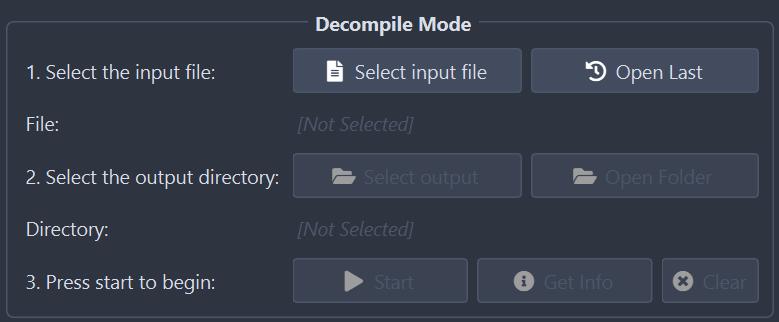
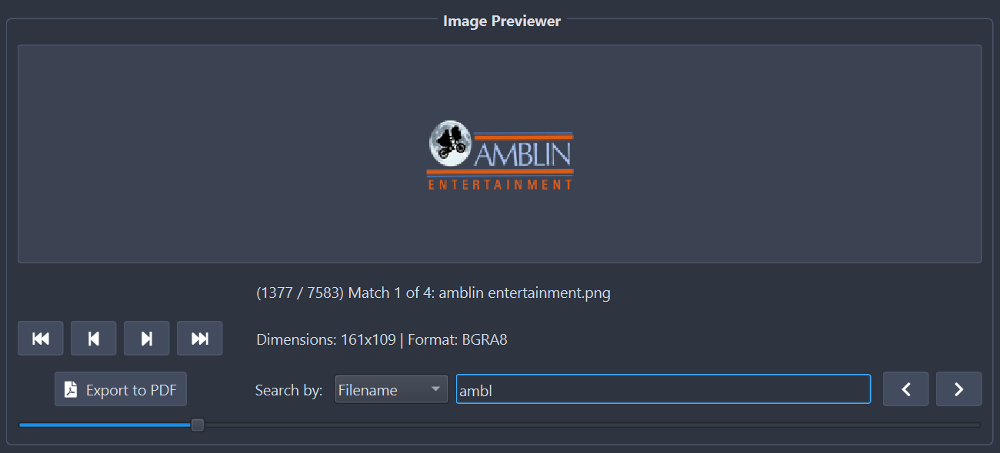

# Kodi TextureTool Guide

Welcome to the official help guide for the Kodi TextureTool. This document provides a complete overview of all features and offers guidance on how to use the application effectively. (Build Date: 8/12/2025)

---

## 1. Critical Requirement: Runtimes {#runtimes-anchor}

For the tool to function correctly, a specific version of the Microsoft Visual C++ 2010 (x86) Redistributable is required.

  

-   **Symptom of Missing Runtimes:** If you try to decompile a `.xbt` file and the output folder is empty, you are missing this component.
-   **How to Install:** The installer is included with the application. Simply go to the **Display -> Install Runtimes** menu option. This will request administrator permission to install the necessary files. This only needs to be done once.

---

## 2. The Main Interface {#main-interface-anchor}

The application is divided into two main sections on the left, a log viewer on the right, and an image previewer at the bottom right.

  

-   **Decompile Mode:** Used for extracting images from a `.xbt` file.
-   **Compile Mode:** Used for packing a folder of images into a new `.xbt` file.
-   **Log Viewer:** Displays a real-time log of all operations, warnings, and errors.
-   **Image Previewer:** Allows you to view the images inside a `.xbt` file after running "Get Info".
-   **Help Dialog:** Accessed via **Help -> View Help File**, this searchable guide includes a table of contents, font controls, and Markdown rendering.

---

## 3. Decompile Mode {#decompile-mode-anchor}

This mode allows you to unpack a Kodi texture file (`.xbt`) into its individual image files (e.g., `.png`).

  

> If you encounter an empty output folder after decompiling, please see the [Troubleshooting](#troubleshooting-anchor) section for information on required runtimes.

### Step-by-Step Usage
1.  **Select Input File:** Click the `Select input file` button to browse for a `.xbt` file.
    -   *Tip:* You can also drag and drop a `.xbt` file directly onto the "Decompile Mode" group box.
    -   *Tip:* Use the `Open Last` button to quickly load the most recent file you used.

2.  **Select Output Directory:** Click the `Select output` button to choose a folder where the extracted images will be saved.
    -   *Tip:* You can also drag and drop a folder onto the "Decompile Mode" group box to set it as the output.

3.  **Choose an Action:**
    -   Click **Start** to begin the full extraction process.
    -   Click **Get Info** to scan the file and populate the [Image Previewer](#image-previewer-anchor) *without* saving the images to the output folder. This is the primary way to use the previewer.

-   **Clear:** Resets the input and output selections for this mode.
-   **Open Folder (Icon):** Opens the selected output directory in your system's file explorer.

---

## 4. Compile Mode {#compile-mode-anchor}

This mode allows you to create a new `.xbt` file from a folder containing your source images.

  

### Step-by-Step Usage
1.  **Select Input Directory:** Click the `Select input folder` button and choose the folder containing the images you want to pack.
    -   *Tip:* You can also drag and drop the source folder directly onto the "Compile Mode" group box.
    -   *Tip:* Use the `Open Last` button to quickly load the most recent folder you used.

2.  **Select Output File:** Click the `Select output file` button and choose where to save your new `.xbt` file, giving it a name.

3.  **Options:**
    -   **Enable dupecheck:** If checked, the compiler will identify duplicate images and only store one copy, referencing it multiple times. This is highly recommended as it can significantly reduce the final file size.

4.  **Start:** Click the `Start` button to begin the compilation process.

-   **Clear:** Resets the input and output selections for this mode.
-   **Open Folder (Icon):** Opens the folder containing your selected output file.

---

## 5. Image Previewer {#image-previewer-anchor}

The previewer is populated by using the **Get Info** button in Decompile Mode. It provides a powerful way to inspect the contents of a `.xbt` file.

  

-   **Navigation Buttons (`<<`, `<`, `>`, `>>`):** Move to the first, previous, next, or last image.
-   **Navigation Slider:** Drag the slider to scrub through images quickly.
-   **Image Info:** The text above the image displays the current image number, total count, search status, and filename.
-   **Image Details:** Below the image, you can see the texture's dimensions and file format.
-   **Search by:** Use the dropdown to select a search criterion:
    -   `Filename`: Find images by typing part of their name.
    -   `Index`: Jump directly to an image number (e.g., `42`).
    -   `Dimensions`: Filter for images of a specific size (e.g., `128x128`).
-   **Search Navigation:** Use the `Previous` and `Next` buttons to cycle through matching search results.
-   **Export to PDF:** Creates a professional PDF gallery of all images and their metadata from the loaded `.xbt` file.
-   **Open Image:** Double-click the displayed image to open it in your system's default image viewer.

---

## 6. Menu Bar & Advanced Features {#menu-bar--advanced-features-anchor}

This section details all functions available in the main application menu bar.

### File Menu
The File menu provides core actions for loading files, accessing recent paths, and controlling the application.

*   **Compile / Decompile:** These sub-menus allow you to select input and output files/folders, mirroring the buttons on the main interface.
*   **Recent Compile / Recent Decompile:** Quickly access a list of the last 8 paths used for each category (e.g., Compile Files, Compile Folders). Each sub-menu also contains a `Clear Recent...` option to erase its history.
*   **Reload All:** Quickly loads the single most recent file and folder used in *both* Decompile and Compile modes.
*   **Close All:** Clears all current input and output selections from both modes.
*   **Exit:** Closes the application.

### Display Menu
This menu controls the application's appearance and behavior after tasks are completed.

*   **Open ... on Completion:**
    *   `Open Decompile/Compile Folder...`: Toggle whether the output folder is automatically opened after a successful operation.
    *   `Open PDF Report...`: Toggle whether a generated PDF gallery is automatically opened after a successful export.
*   **Log Window on Top:** Toggles the vertical position of the Log Viewer and the Image Previewer.
*   **Reset Window Position:** If the application window gets lost off-screen or improperly sized, this will reset it to the center of your primary monitor.
*   **Clear Event Log:** Clears all messages from the Log Viewer panel.
*   **Install Runtimes:** The critical function for installing the required Visual C++ runtimes. For more information, see the [Critical Requirement: Runtimes](#runtimes-anchor) section.

### Options Menu
This menu allows you to configure application startup behavior.

*   **Check for Updates on Startup:** Toggle whether the application automatically checks for a new version every time it is launched.

### Help Menu
Access documentation, support resources, and version information.

*   **About:** Displays the application version, author, and build date.
*   **View Changelog:** Shows a history of all version changes and new features.
*   **View Help File:** Opens this interactive help guide.
*   **Check for Updates...:** Manually checks if a new version of the tool is available for download.

### Dev Mode (Hotkey)
This is a hidden feature primarily intended for debugging purposes.

*   Press `Shift+Alt+D` to enable a "Dev mode" checkbox on the main window.
*   When this checkbox is checked, running a compile or decompile process will first show you a dialog box with the exact command-line string that is being executed.

---

## 7. Troubleshooting {#troubleshooting-anchor}

### The decompile process finishes, but the output folder is empty.
This is the most common issue and is almost always caused by the missing **Visual C++ 2010 (x86) Runtimes**. Please see the [Critical Requirement: Runtimes](#runtimes-anchor) section of this guide and use the **Display -> Install Runtimes** menu option to resolve it.

### How do I report an issue or get support?
The **Help/Support** button below the log viewer is your primary tool. Clicking it will:
1.  Open the official Kodi community forum thread in your web browser.
2.  Open the application's log file (`TextureTool_Log.txt`) in your text editor.

> When posting on the forum, please copy and paste the entire contents of this log file into your post. It contains vital diagnostic information.